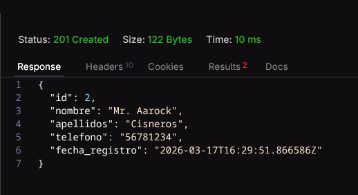
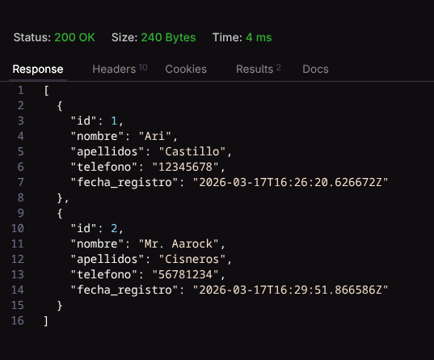
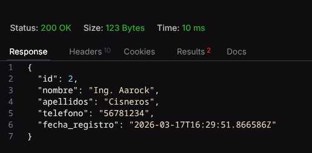
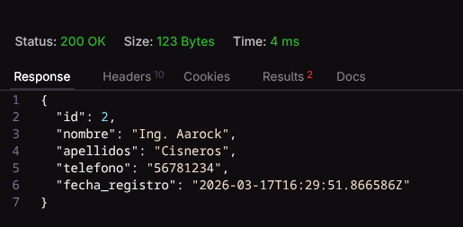

# backend_chichita

API backend construida con Django y Django REST Framework para la gestión básica de pacientes.

## Descripción general

El proyecto expone un recurso principal llamado `Paciente`, con operaciones CRUD completas mediante un `ModelViewSet` y rutas generadas por `DefaultRouter`.

## Modelo de datos

La entidad central del sistema es `Paciente`.

``` python
from django.db import models


class Paciente(models.Model):
        nombre = models.CharField(max_length=100)
        apellidos = models.CharField(max_length=100)
        telefono = models.CharField(max_length=15)
        fecha_registro = models.DateTimeField(auto_now_add=True)

        def __str__(self):
                return f"{self.nombre} {self.apellidos}"
```

### Campos

-   `nombre`: nombre del paciente.
-   `apellidos`: apellidos del paciente.
-   `telefono`: número de contacto.
-   `fecha_registro`: fecha y hora de creación del registro. Se genera automáticamente.

## Arquitectura de la API

### Serializer

El serializador expone todos los campos del modelo y protege `fecha_registro` para evitar modificaciones manuales.

``` python
class PacienteSerializer(serializers.ModelSerializer):
        class Meta:
                model = Paciente
                fields = '__all__'
                read_only_fields = ('fecha_registro',)
```

### Vista

La API utiliza un `ModelViewSet`, por lo que incluye las operaciones:

-   listar
-   crear
-   recuperar detalle
-   actualizar
-   eliminar

``` python
class PacienteViewSet(viewsets.ModelViewSet):
        queryset = Paciente.objects.all()
        serializer_class = PacienteSerializer
```

### Rutas disponibles

Prefijo base:

-   `/api/`

Endpoints principales:

-   `GET /api/pacientes/` — lista de pacientes
-   `POST /api/pacientes/` — crear paciente
-   `GET /api/pacientes/{id}/` — detalle de un paciente
-   `PUT /api/pacientes/{id}/` — actualización completa
-   `PATCH /api/pacientes/{id}/` — actualización parcial
-   `DELETE /api/pacientes/{id}/` — eliminar paciente


### Testo de la API


#### Crear un paciente



#### Listar pacientes




#### Actualizar un paciente




#### Detalle de un paciente




#### Eliminar paciente
